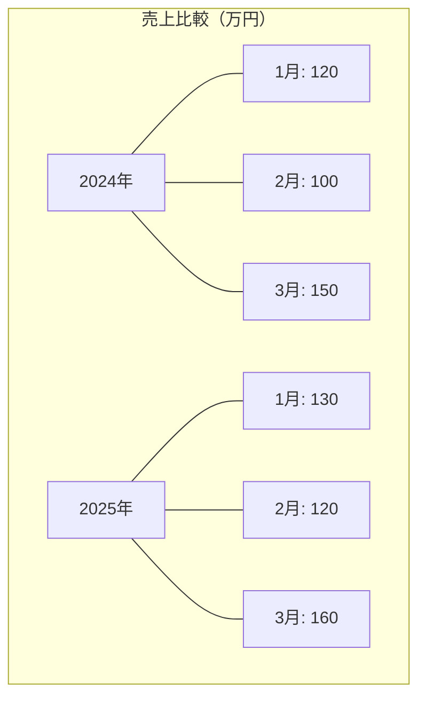
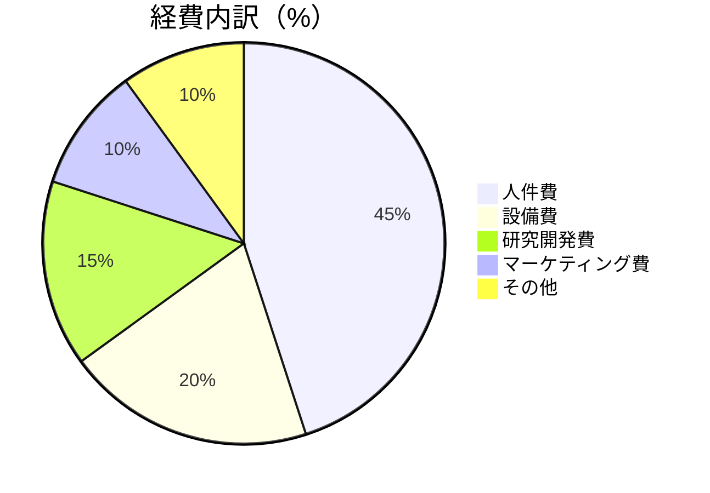
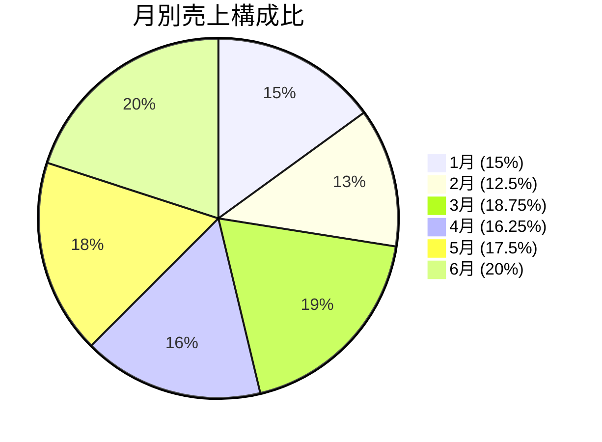

# 図表の読み取りチートシート

## グラフの種類と特徴

### 棒グラフ
- **特徴**: 量や個数の比較に適している
- **読み取るポイント**:
  - 棒の高さ（縦棒グラフ）または長さ（横棒グラフ）
  - 目盛りと軸ラベル
  - 複数グループの比較（グループ化された棒グラフの場合）

**例: 各月の売上（万円）**

```
売上(万円)
160 |                  ■
150 |          ■       
140 |                ■
130 |              ■   
120 | ■                
110 |                  
100 |    ■             
    +------------------
       1月 2月 3月 4月 5月 6月
```

または、表で表現:

| 月 | 売上(万円) |
|----|-----------|
| 1月 | 120      |
| 2月 | 100      |
| 3月 | 150      |
| 4月 | 130      |
| 5月 | 140      |
| 6月 | 160      |

**複数グループの比較例（2024年と2025年の売上比較）**



### 折れ線グラフ
- **特徴**: 時間経過による変化・傾向の把握に適している
- **読み取るポイント**:
  - 上昇・下降の傾向
  - ピークと底（最大値・最小値）
  - 傾きの大きさ（変化の速さ）
  - 複数折れ線の交差点（等しくなる点）

**例: 3年間の四半期売上推移**

```
売上(百万円)
50 |                    *
   |                   /
40 |                  /
   |       *         /
30 |      / \       /
   |     /   \     /
20 |    /     \   /
   |   /       \ /
10 | */         *
   |/
 0 +-------------------------
    Q1  Q2  Q3  Q4  Q1  Q2  Q3
    ---2023年--- ---2024年---
```

### 円グラフ（パイチャート）
- **特徴**: 全体に対する割合の比較に適している
- **読み取るポイント**:
  - 各部分の割合（%）
  - 割合の大小関係
  - 半分（50%）以上か未満か

**例: 経費内訳**



### 帯グラフ
- **特徴**: 構成比や時系列での割合変化の比較に適している
- **読み取るポイント**:
  - 各部分の割合とその変化
  - 合計値（全体の長さが異なる場合）

**例: 年代別人口構成比の変化**

```
2020年 [######## 40% ######## | ##### 25% ##### | #### 20% #### | ### 15% ###]
2025年 [####### 35% ####### | ##### 25% ##### | ##### 25% ##### | ### 15% ###]
2030年 [###### 30% ###### | ##### 25% ##### | ###### 30% ###### | ### 15% ###]
        ------10代〜30代----- --40代-- ------50代〜60代------ --70代以上--
```

### 表（テーブル）
- **特徴**: 複数の項目や期間の詳細データを整理できる
- **読み取るポイント**:
  - 行と列の見出し
  - セル内の数値
  - 小計・合計の行/列

**例: 四半期別部署別売上（単位：百万円）**

| 部署/四半期 | Q1  | Q2  | Q3  | Q4  | 合計 |
|-----------|-----|-----|-----|-----|-----|
| 営業部 A   | 120 | 140 | 130 | 150 | 540 |
| 営業部 B   | 100 | 110 | 120 | 130 | 460 |
| 営業部 C   |  80 |  90 | 100 | 110 | 380 |
| 合計       | 300 | 340 | 350 | 390 | 1380|

## 頻出問題パターンと解法テクニック

### パターン1: 合計値・平均値の算出
```
問題例: 以下のグラフはA社の2020年1月から6月までの月間売上（万円）を示しています。
       この期間の総売上と月平均売上を求めなさい。
       [1月:120, 2月:100, 3月:150, 4月:130, 5月:140, 6月:160]
```

**解法**:
1. 総売上 = 120 + 100 + 150 + 130 + 140 + 160 = 800万円
2. 月平均売上 = 800 ÷ 6 = 133.3万円

### パターン2: 増減率・変化率の計算
```
問題例: グラフによると、A社の売上は1月が120万円、3月が150万円でした。
       1月から3月までの売上増加率は何%ですか？
```

**解法**:
1. 増加額 = 150 - 120 = 30万円
2. 増加率 = 30 ÷ 120 × 100 = 25%

**図解**:
```
増加率 = (後の値 - 前の値) ÷ 前の値 × 100%

売上(万円)
150 |          ■       
    |          |
    |          | 増加額
    |          | 30万円
120 | ■        |       
    |          |
    +----------+-------
       1月      3月

増加率 = 30 ÷ 120 × 100 = 25%
```

### パターン3: 最大値・最小値とその時期
```
問題例: A社の1月から6月の売上の中で、最も高かった月とその金額はいくらですか？
```

**解法**:
1. 各月の売上を比較: [1月:120, 2月:100, 3月:150, 4月:130, 5月:140, 6月:160]
2. 最大値は6月の160万円

**図解**:
```
売上(万円)
160 |                  ■ ← 最大値
150 |          ■       
140 |                ■
130 |              ■   
120 | ■                
110 |                  
100 |    ■             
    +------------------
       1月 2月 3月 4月 5月 6月
```

### パターン4: 構成比の計算（円グラフ・帯グラフ）
```
問題例: A社の総売上800万円のうち、2月の売上が占める割合は何%ですか？
```

**解法**:
1. 2月の売上 = 100万円
2. 割合 = 100 ÷ 800 × 100 = 12.5%

**図解**:


### パターン5: 複合グラフの読み取り
```
問題例: 以下のグラフはA社の月間売上高（棒グラフ）と前年同月比（折れ線グラフ）を表しています。
       4月の売上高と前年同月比から、前年4月の売上高を求めなさい。
       [4月売上: 130万円, 前年同月比: 108.3%]
```

**解法**:
1. 前年同月比 = 今年の売上 ÷ 前年の売上 × 100
2. 108.3% = 130 ÷ 前年4月売上 × 100
3. 前年4月売上 = 130 ÷ 1.083 = 120万円

**図解**:
```
        売上高(万円)      前年同月比(%)
160 |                  |          
    |                  |   *      
150 |          ■       |  /       
    |                  | /        
140 |                ■ |/         
    |                  *          
130 |              ■   |          
    |                  |          
120 | ■                |          
    |                  |          
110 |                  |          
    |                  |          
100 |    ■             |          
    +------------------+----------
       1月 2月 3月 4月 5月 6月
       
4月の売上高: 130万円
4月の前年同月比: 108.3%
前年4月の売上高 = 130 ÷ 1.083 = 120万円
```

## 図表読み取りのコツと注意点

### 1. グラフの軸と目盛りを確認する
- **縦軸・横軸の単位**: 円、万円、千円などの単位
- **目盛りの間隔**: 等間隔でない場合や途中から省略されている場合に注意
- **グラフの原点**: 0から始まっていない場合、視覚的な印象が実際と異なる

**注意が必要なグラフ例（原点が0でない場合）**:
```
売上(百万円)
100 |                  
 95 |          ■       
    |                  
 90 | ■                
    |                  
 85 |    ■             
    +------------------
       1月 2月 3月
```
⬆ このグラフだと、売上の差が実際より大きく見える！

**実際の比率を正確に表すグラフ**:
```
売上(百万円)
100 |                  
    |                  
 90 | ■        ■       
    |                  
 80 |                  
    |                  
 70 |                  
    |                  
 60 |                  
    |                  
 50 |                  
    |                  
 40 |                  
    |                  
 30 |                  
    |                  
 20 |                  
    |                  
 10 |                  
    |    ■             
  0 +------------------
       1月 2月 3月
```

### 2. 凡例（legend）を確認する
- **複数系列の区別**: 色分け、パターン分け、マーカーの形状の違いなど
- **単位や補足情報**: 「単位：百万円」「※2023年は予測値」など

**複数系列のグラフ例**:
```
売上(百万円)
100 |                  
    |          ■       
 80 |               □  
    | ■     □          
 60 |     ■     □      
    |   □              
 40 | □                
    |                  
 20 |                  
    |                  
  0 +------------------
       Q1  Q2  Q3  Q4
       
凡例: ■ 2024年  □ 2023年
```

### 3. タイトルと注釈を読む
- グラフのタイトル、軸ラベル、注釈には重要な情報が含まれている

### 4. 複数のグラフを比較する場合
- 単位や縮尺が同じかどうかを確認
- 同じ期間や条件で比較しているか確認

### 5. トレンド（傾向）を読み取る
- 単純な上昇・下降だけでなく、周期性、加速・減速、特異点などに注目

**トレンド分析の例**:
```
売上(百万円)
100 |                           *
    |                      *   /
 80 |                     /   /
    |                    /   /
 60 |         *         /   /
    |        / \       /   /
 40 |       /   \     /   /
    |      /     \   /   /
 20 |     /       \ /   /
    |    *         *   *
  0 +----------------------
     Q1 Q2 Q3 Q4 Q1 Q2 Q3 Q4
     --- 2023年 --- 2024年 --
     
観察できるトレンド:
- 2023年は四半期ごとに上下の波がある（季節変動）
- 2024年は一貫して上昇傾向（成長トレンド）
- 全体としては右肩上がりの成長（長期トレンド）
```

## よくある間違いと対策

1. **軸の誤読**: 縦軸が0から始まっていない、縮尺が不均一など
   → グラフを見る前に必ず軸のラベルと目盛りを確認

2. **単位の見落とし**: 「万円」なのか「百万円」なのかなど
   → グラフ全体のタイトル、軸ラベル、凡例を最初に確認

3. **視覚的錯覚**: 3Dグラフなどで実際の数値より大きく/小さく見える
   → 必ず数値を読み取って計算で確認

4. **計算間違い**: 複数の数値を合計するときの単純な計算ミス
   → 計算過程を書き出し、答えを見直す

5. **時系列の混同**: 「前年比」と「前月比」の混同など
   → 何と何を比較しているのかを明確にする

## 実践的なアプローチ方法

1. 問題文とグラフ・表を丁寧に読む（読み落としをしない）
2. 必要な情報と計算方法を整理する
3. 冷静に計算し、答えの妥当性を検証する
4. 時間短縮のために、複雑なグラフでも必要な部分だけに注目する