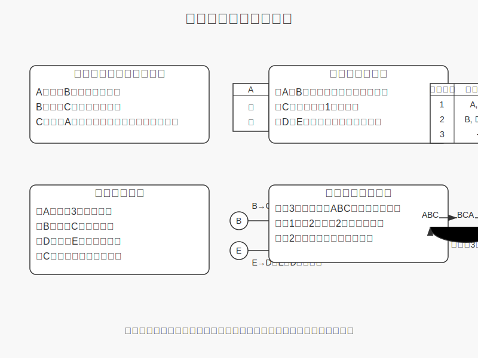

# 推論・図形問題チートシート

## 図形問題の主要カテゴリと対策

### 1. 展開図問題
**問題タイプ**:
- 立方体や直方体の展開図が示され、組み立てた時の形や、向かい合う面を問われる

**解法のコツ**:
- **頂点に注目する**: 同じ頂点に集まる面を特定する
- **辺をたどる**: 展開図の辺同士の接続関係を確認する
- **面の隣接関係**: となりあう面と、向かい合う面の関係を整理する

**具体的テクニック**:
1. 展開図に番号や記号をつけて追跡しやすくする
2. 頭の中で折りたたむ練習をする
3. 正方形が6枚ある立方体の場合、向かい合う面の和が7になるパターンが多い


### 2. 立体の切断問題
**問題タイプ**:
- 立方体や円柱などの立体を平面で切断したときの断面図を問う

**解法のコツ**:
- **切断方向に注目**: 水平・垂直・斜めのどの方向で切るか
- **断面図の特徴**: 立体と切断面の交点が作る図形の特徴を理解する

**代表的な断面**:
- 立方体を対角線上に切ると、正六角形になる
- 円柱を斜めに切ると、楕円になる
- 円錐を垂直に切ると、双曲線、放物線、楕円などになる（切る位置による）


### 3. 回転体問題
**問題タイプ**:
- 平面図形を特定の軸を中心に回転させたときにできる立体を問う

**解法のコツ**:
- **回転軸の特定**: どの直線を中心に回転するか明確にする
- **断面の把握**: 回転体の断面がどのような図形になるか考える

**基本的な回転体**:
- 円を直径で回転 → 球
- 長方形を一辺で回転 → 円柱
- 直角三角形を一辺で回転 → 円錐
- 半円を直径で回転 → 球


### 4. 空間把握・視点移動問題
**問題タイプ**:
- 立体を異なる角度から見たときの図を選ぶ
- 立体を積み上げたり、一部取り除いたりしたときの形を問う

**解法のコツ**:
- **三方向からの視点**: 正面・側面・上面からの図を想像する
- **位置関係の整理**: 各部分の相対的な位置を確認する

**実践テクニック**:
1. 三次元座標を意識し、x, y, z軸を設定する
2. 簡単な立体から徐々に複雑な形を構築して考える
3. 視点を移動させながら頭の中でイメージを回転させる練習をする


## 論理推論問題の主要カテゴリと対策

### 1. 真偽推理（嘘つき問題）
**問題タイプ**:
- 複数の人の発言があり、誰が嘘をついているか推理する問題

**解法のコツ**:
- **整合性の確認**: 全ての発言が整合するかチェック
- **仮定法**: 特定の人が嘘/本当と仮定して矛盾がないか確認

**基本パターン**:
1. 「Aは嘘つき」という発言自体の真偽を確認
2. 「もしAが本当なら、Bも本当」といった条件付き推論
3. 全ての可能性を表にして整理（真・偽の組み合わせ）

### 2. 順序推理（順位・座席順問題）
**問題タイプ**:
- 「Aさんはテストで5位、BさんはCさんより上位...」などから順位を推定

**解法のコツ**:
- **矢印図の活用**: A→B（AはBより前/上）などと矢印で関係を図示
- **消去法**: 可能性のある位置を1つずつ消していく

**実践テクニック**:
1. 数直線上に位置関係を整理
2. 表を使って可能性を網羅する
3. 確定している位置から固定して考える

### 3. 条件組合せ問題
**問題タイプ**:
- 「AとBは同じグループに入れない」「Cはグループ1に属する」などの条件から組み合わせを考える

**解法のコツ**:
- **条件の視覚化**: ○×表などで条件を図示
- **ツリーダイアグラム**: 分岐を木構造で表現
- **場合分け**: 重要な条件から場合分けを行う

**実践テクニック**:
1. 最も制約の強い条件から取り組む
2. 確定した要素を固定して残りを考える
3. 条件の言い換え（「AとBは同じグループに入れない」→「AとBは異なるグループ」）

### 4. 操作手順推論問題
**問題タイプ**:
- 特定の操作（移動・交換など）を繰り返した後の状態を推論

**解法のコツ**:
- **パターンの発見**: 操作の繰り返しで生じる規則性を見つける
- **周期性の利用**: 同じ状態に戻る周期を特定

**実践テクニック**:
1. 数回分の操作結果を実際に書き出す
2. 周期を見つけたら、問題の回数÷周期の余りを考える
3. 特徴的な位置・要素に注目する



## 図形問題の解法テクニック

### 展開図問題の解き方例
```
問題例: 次の展開図から組み立てられる立方体で、面Aの向かい側にくる面はどれか？
```

**アプローチ**:
1. 中心となる面（最も他の面と接している面）を特定
2. そこから各面の相対位置を確認
3. 面Aから最も遠い位置（辺でつながっていない）の面が向かい側

### 立体の切断解法例
```
問題例: 立方体を1つの頂点と、その対角にある頂点を通る平面で切断したとき、できる断面はどんな形か？
```

**アプローチ**:
1. 切断される辺を特定（対角線を通る平面は、立方体の3つの辺を切断）
2. 切断点を結ぶと正三角形または二等辺三角形になる

## 論理推論問題の解法テクニック

### 真偽推理の解き方例
```
問題例: 3人の証言があります。
Aさん「Bさんは嘘をついている」
Bさん「Cさんは嘘をついている」
Cさん「Aさんは本当のことを言っている」
嘘をついているのは何人ですか？
```

**アプローチ**:
1. 全ての真偽パターンを表にする（2³=8通り）
2. 各パターンで矛盾が生じないか確認
3. 整合するパターンから、嘘つきの人数を求める

### 順序推理の解き方例
```
問題例: 5人の着順について以下がわかっています。
・Aさんは3位ではない
・BさんはCさんより前
・DさんはEさんより後ろ
・Cさんは最下位ではない
Dさんの順位は何位ですか？
```

**アプローチ**:
1. 確定している関係から順位表を作る
2. B→C（BはCより前）、E→D（EはDより前）を図示
3. 他の条件と合わせて消去法で位置を特定

## 試験対策のコツとよくある間違い

### 図形問題の対策
1. **実際に手を動かす**: 紙に描いたり、実物を使って立体をイメージ
2. **パターン練習**: 典型的な展開図・切断パターンを覚える
3. **視点移動の訓練**: 異なる角度からの見え方を想像する練習

### 論理推理の対策
1. **条件整理の習慣化**: 複雑な条件を図・表・記号で整理
2. **矛盾検出力の強化**: 条件間の矛盾を素早く見つける練習
3. **場合分けの徹底**: 可能性を漏れなく検討する習慣

### よくある間違いと対策
1. **条件見落とし**: 条件を箇条書きにして1つずつ確認
2. **不十分な場合分け**: 全パターンを系統的に確認
3. **立体イメージ不足**: 日常で立体物の構造に注目する習慣をつける
4. **論理の飛躍**: 推論の各ステップを明確にする
5. **時間配分ミス**: 解けそうにない問題は一時保留する勇気を持つ

## 実戦的な時間短縮テクニック
1. **消去法の活用**: 明らかに違う選択肢から消していく
2. **極端な条件確認**: 最も制約の強い条件から考える
3. **答えの検算**: 導いた答えが全ての条件を満たすか再確認
4. **図示の簡略化**: 問題の本質を捉えた簡潔な図解を心がける
5. **パターン認識**: 過去に解いた問題との類似点を活かす